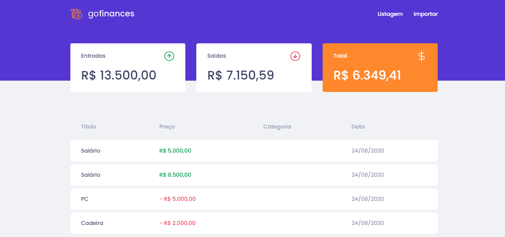
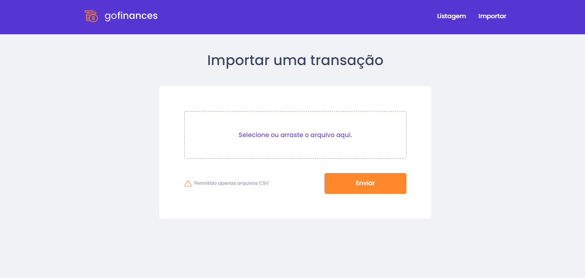

<h1 align="center">
  
</h1>

<p align="center">
  
  
</p>

---

## 🚀 Tecnologies

This project was developed at the Rocketseat GoStack Bootcamp with the following technologies:

- [ReactJS](https://reactjs.org)
- [Typescript](https://www.typescriptlang.org/)
- [styled-components](https://styled-components.com/)
- [Axios](https://github.com/axios/axios)
- [API](https://github.com/willianPetri/node-TypeORM)
- [VS Code](https://code.visualstudio.com/) with [EditorConfig](https://marketplace.visualstudio.com/items?itemName=EditorConfig.EditorConfig) and [ESLint](https://marketplace.visualstudio.com/items?itemName=dbaeumer.vscode-eslint)

---

## ⚙️ How To Use

```bash

  # Clone this repository
  $ git clone https://github.com/willianPetri/GoFinances.git

  # Go into the repository
  $ cd GoFinances

  # Install dependecies
  $ yarn install

  # Run api
  # Run the project
  $ yarn start
```

---

Made with ❤ by Willian Petri  [✌ Get in touch!](https://www.linkedin.com/in/willian-petri-84a935135/)
